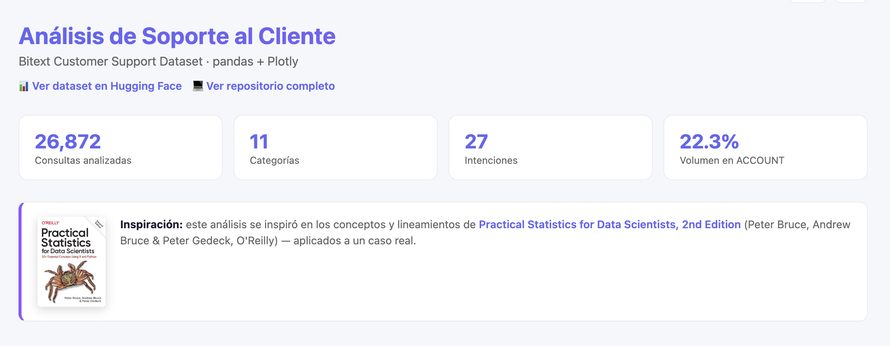
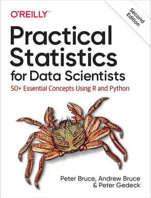

# Análisis de Soporte al Cliente — Bitext Customer Support Dataset

Análisis exploratorio de un dataset público de conversaciones de soporte al cliente, enfocado en identificar qué categorías de consulta concentran mayor volumen y complejidad, como insumo para decisiones de priorización en automatización de soporte.

**Dashboard interactivo:** [estanimolinas.github.io/bitext-customer-support-analysis](https://estanimolinas.github.io/bitext-customer-support-analysis/)



## Pregunta de negocio

¿Qué categorías de consulta concentran mayor volumen y complejidad, y qué implica eso para priorizar dónde invertir en automatización de soporte al cliente?

## Fuente de datos

[Bitext Customer Support LLM Chatbot Training Dataset](https://huggingface.co/datasets/bitext/Bitext-customer-support-llm-chatbot-training-dataset) (Hugging Face) — 26,872 filas, 11 categorías, 27 intenciones.
Licencia: CDLA-Sharing-1.0.

## Hallazgos principales

- **ACCOUNT concentra el mayor volumen** (22.3% del total) y la mayor variedad de intenciones (6 de 27) — la categoría más frecuente y estructuralmente más compleja.
- **REFUND muestra la mayor variabilidad** en longitud de respuesta (desvío estándar de 566, casi igual a su mediana) — los casos de reembolso van de simples a muy extensos.
- **No hay relación entre la extensión de la consulta y la de la respuesta** (correlación de 0.11) — la complejidad depende del tipo de consulta, no de cuánto escribió el usuario.
- **La longitud de respuesta tiene asimetría positiva marcada** (1.7) y curtosis alta (3.7) — la mayoría de respuestas son cortas, pero una cola de casos extensos empuja la media (634) por encima de la mediana (540).

Ver el análisis completo en [`notebooks/01_exploracion.ipynb`](notebooks/01_exploracion.ipynb) o explorar el [dashboard interactivo](https://estanimolinas.github.io/bitext-customer-support-analysis/).

## Inspiración

Este análisis se inspiró en los conceptos y lineamientos de [*Practical Statistics for Data Scientists, 2nd Edition*](https://www.oreilly.com/library/view/practical-statistics-for/9781492072935/) (Peter Bruce, Andrew Bruce & Peter Gedeck, O'Reilly) — medidas de tendencia central, variabilidad, asimetría y curtosis aplicadas a un caso real.



## Stack

- **pandas** — limpieza y análisis
- **plotly** — visualización interactiva (barras, boxplot, violin, sunburst, scatter, heatmap, subplots, radar)
- **Jupyter** — desarrollo y narrativa del análisis
- **GitHub Pages** — dashboard publicado con navegación, modo oscuro y traducción ES/EN

## Estructura del repo

```
data/           dataset original (CSV, no versionado)
notebooks/      notebook de análisis exploratorio
docs/           dashboard publicado (GitHub Pages) + gráficos HTML
src/            scripts reutilizables (si aplica)
```

## Cómo correrlo

```bash
python3 -m venv .venv
source .venv/bin/activate
pip install pandas plotly datasets jupyter
```

Descargar el dataset:

```bash
python3 -c "from datasets import load_dataset; ds = load_dataset('bitext/Bitext-customer-support-llm-chatbot-training-dataset'); ds['train'].to_pandas().to_csv('data/bitext_raw.csv', index=False)"
```

Abrir `notebooks/01_exploracion.ipynb` en VSCode o Jupyter, seleccionar el kernel del `.venv`, y correr las celdas en orden.

---

Por [Estanislao Molinas](https://github.com/estanimolinas) · [LinkedIn](https://www.linkedin.com/in/estanislao-molinas-4057ba1b8/)